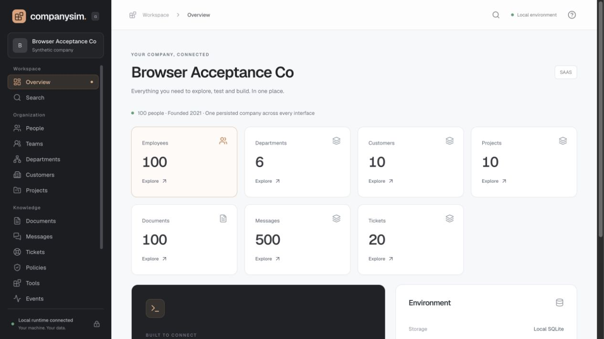
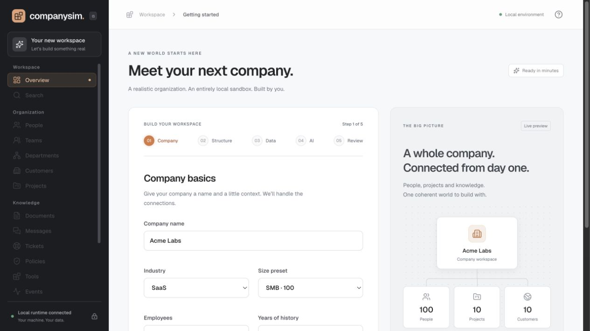
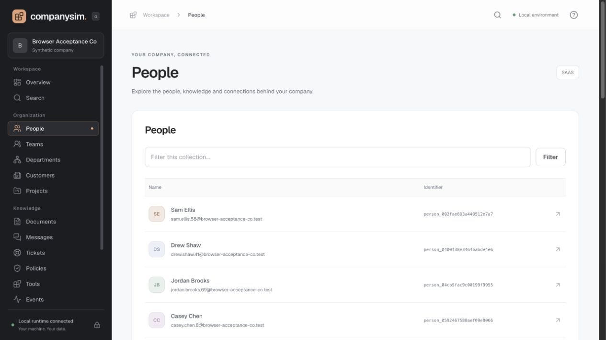

# CompanySim

**Give your AI agent an entire company to work with. Locally.**

[](https://github.com/dolevhayut/companysim/actions/workflows/ci.yml)
[](LICENSE)
[](CHANGELOG.md)

Spin up a fictional organization with employees, teams, customers, projects, documents, messages and tickets — connected through consistent identities and relationships. Explore it in your browser or let your agent query it through MCP.

**No API key required. No cloud account. One local SQLite dataset across browser, REST, MCP and CLI.**



[Quickstart](#docker-quickstart) · [Connect your agent](#connect-your-agent) · [Scenario Lab](#scenario-lab) · [Screenshots](#a-company-you-can-explore) · [Enrichment](#optional-enrichment) · [Contributing](CONTRIBUTING.md)

## Why CompanySim?

Agent and integration demos need more than unrelated mock JSON. CompanySim supplies a repeatable company with a shared history: people belong to teams, projects connect to customers, and documents and conversations refer to the same entities.

- **Test agents:** evaluate search, retrieval and relationship traversal against a controlled world.
- **Build integrations:** use REST, MCP or CLI against the same persisted company.
- **Demo products:** show meaningful data without a production database.
- **Repeat experiments:** reuse a seed, save a snapshot, and restore a baseline.
- **Add realistic prose:** optionally enrich documents, messages and tickets with your own OpenAI or Anthropic key.

## A company you can explore

### Create your workspace

Choose company size, seed, history, data density and optional AI in a five-step wizard.



### Follow people and relationships

Explore the organization and inspect records with their stable IDs, details and relationships.



Screenshots show an actual synthetic demo company. No production company data is included.

## Connect your agent

After generating a company, open **Developer → Copy agent setup prompt**. Paste it into your local coding agent to configure MCP, install the included skill if supported, and verify the connection.

For an installed Codex CLI:

```sh
codex mcp add companysim --url http://localhost:4545/mcp
```

Then ask:

> Use CompanySim to summarize the company. Find a project, identify the people and customer connected to it, and show the documents that support your answer. Cite the entity IDs.

The Developer screen also includes Claude Code configuration, a downloadable `SKILL.md`, and connection troubleshooting. MCP tools are read-only. A cloud agent cannot reach your machine's localhost directly.

## Scenario Lab

Open **Scenario Lab** after creating a company to apply a controlled delivery-risk, renewal-risk or security-review change. The preview shows every changed field before it is written, and the run creates an auditable `scenario_applied` event in the same SQLite dataset used by REST and MCP.

Save a snapshot before applying a scenario when you want a restore point. After applying it, run the local readiness check and copy its agent prompt into an MCP-connected agent. The check verifies that the scenario records resolve and can be found through CompanySim search; it does not execute or score a third-party agent.

## Docker quickstart

Requires Docker with Compose and Git. Clone the repo, then build and start locally:

```sh
git clone https://github.com/dolevhayut/companysim.git
cd companysim
docker compose up --build -d
```

Open [localhost:4545](http://localhost:4545), complete the wizard, and create your company. The named volume persists data across restarts. Stop with `docker compose down`; the named volume remains. The first run builds the image from source; there is no published registry image yet.

For BYOK, export `OPENAI_API_KEY` or `ANTHROPIC_API_KEY` in your shell before starting Docker Compose; the supplied Compose file forwards those variables. Do not put literal keys in shell commands. Browser keys are session-only and stored in server memory.

## Developer setup

Node.js 24 LTS or newer and pnpm 10.32.1 are required. Node's built-in SQLite supplies FTS5; no native SQLite package compilation is needed.

```sh
corepack enable
corepack prepare pnpm@10.32.1 --activate
pnpm install --frozen-lockfile
pnpm check
pnpm company create acme --employees 100 --seed 42 --yes --data-dir ./company-data
pnpm dev --data-dir ./company-data
```

`pnpm build` compiles the runtime and React/Vite UI. `pnpm dev` serves the compiled UI, so build first. Server defaults to loopback, port 4545. Each write-capable process takes a data-directory lock. Stop the server before CLI operations that mutate its database; use the browser controls while it runs.

## CLI

```sh
pnpm company init --yes
pnpm company create testco --mode lite --employees 50 --seed 42 --yes
pnpm company status --json
pnpm company inspect person PERSON_ID --json
pnpm company search "Atlas Migration" --limit 20
pnpm company snapshot create baseline
pnpm company snapshot restore baseline --yes
pnpm company doctor --json
pnpm company export --format json --output company-export.json
pnpm company import company-export.json --yes
pnpm company reset --yes
```

Use `--data-dir PATH` on every command to target an explicit environment. Defaults to `~/.local/share/companysim`, or `COMPANYSIM_DATA_DIR`. YAML configuration follows `companysim.example.yaml`. `--config` selects a file. `--history 5y`, `--density low|medium|high` and `--force` are supported.

After `pnpm build`, `npm pack` creates an installable CLI package with `company` and `companysim` aliases. Install the tarball with `npm install -g ./companysim-0.1.0-alpha.1.tgz`.

JSON is the complete, versioned, round-trip export (including job progress); SQLite export is also importable. JSONL and CSV exports contain entity rows for analysis, not full environment backups.

## REST and MCP

- REST: `http://localhost:4545/api/v1`
- Interactive local API explorer: `http://localhost:4545/docs`
- OpenAPI 3.1: `http://localhost:4545/openapi.json`
- MCP Streamable HTTP: `http://localhost:4545/mcp`
- MCP stdio: `company mcp --data-dir ./company-data`

```sh
curl http://localhost:4545/api/v1/people?limit=5
curl -H 'Content-Type: application/json' -d '{"query":"Atlas Migration"}' http://localhost:4545/api/v1/search
```

MCP configuration:

```json
{"mcpServers":{"companysim":{"url":"http://localhost:4545/mcp"}}}
```

The official MCP SDK implements both transports. All tools are read-only. REST list endpoints use opaque keyset cursors. Search uses SQLite FTS5 BM25 (lower is more relevant), then one-hop relationships; expanded entities have score zero. No LLM is called for search.

Supply `X-CompanySim-Actor` for synthetic actor visibility. Unscoped requests are operator access. Search header/body actors must match. Control routes under `/api/control` are experimental; `/api/v1` is the public alpha data API. Set `COMPANYSIM_API_TOKEN` for a local bearer token when exposing beyond loopback. Cross-origin browser requests are rejected.

## Optional enrichment

```sh
pnpm company provider test openai
pnpm company generate --provider openai --model YOUR_MODEL_ID --max-cost 1 --cost-per-job 0.02
pnpm company generate --resume
```

Anthropic uses the same flags with `--provider anthropic`. Select an available model explicitly. Enrichment sends selected synthetic content and historical context to that provider. Imported data is sent only when enrichment is explicitly requested. Keys never enter the company DB, snapshot or export. Provider errors expose safe categories, not upstream request bodies.

`--cost-per-job` is a **user-supplied approximate reservation**, not a billing guarantee. Each request reserves this amount before sending; retries reserve again, and budget exhaustion stops before the next request. Unknown provider/model pricing is not guessed. Completed jobs survive failures, cancellation and restart. Switch provider/model on resume by supplying new options. `--only documents,messages,tickets` narrows work.

## Reproducibility

Generator version 1 normalizes a fixed `asOf` timestamp (`2026-01-01T00:00:00.000Z`), seed and configuration. IDs use SHA-256 namespace derivation; names use seeded Mulberry32. Same normalized config, seed and generator version produce identical Lite state. History uses explicit role intervals, including a tested promotion. All domains are fictional `.test` identities.

## Validation

```sh
pnpm typecheck
pnpm lint
pnpm test
pnpm build
pnpm exec playwright install chromium # once
pnpm test:e2e
pnpm test:docker
```

See [IMPLEMENTATION_NOTES.md](IMPLEMENTATION_NOTES.md) for choices, limits and acceptance evidence. Specs remain the source of truth. No published image, package or external-provider success is implied by this local build.

## Browser export, enrichment and agent setup

- **Export:** Settings → Data controls → Export CompanySim JSON. The download includes the configured local API bearer token in its request and contains the round-trip company state, excluding provider credentials.
- **Enrich:** Settings → choose provider → enter a session key if needed → Refresh models → select model → set Maximum cost and Approximate reserve per job → Test connection → Start enrichment. Watch the generation panel for progress, cancellation and resume. A connection test validates catalog access; it does not run model generation. Reservations are estimates, not guaranteed billing caps.
- **Agents:** Developer → Copy agent setup prompt. Paste into your local agent to configure MCP, install the included skill if supported, and verify with `get_company` / `get_company_stats`. Download agent skill exports a `SKILL.md` with the current runtime URL. The maintained source template is [docs/skills/companysim/SKILL.md](docs/skills/companysim/SKILL.md); the UI resolves its base URL placeholder. MCP setup examples include Codex CLI and Claude Code project configuration. Existing client configuration must be preserved. Localhost requires an agent running on the same machine; cloud agents cannot reach it directly.
- **Scenarios:** Scenario Lab → Preview → optionally create a snapshot → Apply to company → Run readiness check. The copied prompt tells an MCP-connected agent to investigate the scenario without mutating the company.

## Public alpha scope

The alpha supports SaaS/generic company profiles, automatic organization structure, basic actor visibility, keyword search, one-hop relationship expansion and three controlled scenario mutations. Semantic search, customizable scenario builders and hosted deployments are roadmap work. AI enrichment changes prose, not the company graph; cost reservations are estimates, not provider billing guarantees.

Automated checks cover deterministic generation, reference integrity, persistence, REST/MCP parity, SDK boundaries, model filtering, browser setup/export and Docker. Live provider enrichment was also manually verified by the maintainer. See [implementation notes](IMPLEMENTATION_NOTES.md) for scope and evidence.

## Contribute

Bug reports, reproducible agent workflows and improvements to data realism are welcome. Read [CONTRIBUTING.md](CONTRIBUTING.md), browse the [roadmap](ROADMAP.md), or [open an issue](https://github.com/dolevhayut/companysim/issues).

If CompanySim helps your work, a star helps other developers discover it.

## License & acknowledgements

CompanySim is [MIT licensed](LICENSE). UI patterns were adapted from community components discovered through 21st.dev; see [acknowledgements](docs/ACKNOWLEDGEMENTS.md). Dependencies retain their own licenses.
